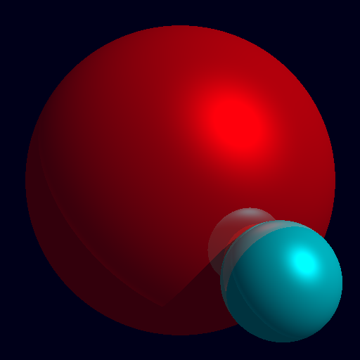

# Ray-Tracing
This is a simple ray-tracing program written for fun.
I'm neither good at C or Computer Graphics, but it is
really interesting.
If you have any advise, please file an issue. 😘

# Result

